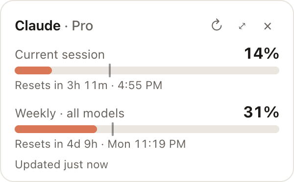

# Headroom

**Your Claude plan limits, always in view.** A small desktop widget and menu-bar item that shows how much of your Claude **5-hour session** and **weekly** limits you've used, and when each one resets. The same numbers Claude keeps under Settings → Usage, without the clicking.



- **Live bars** for every limit on your plan: the 5-hour session, the weekly all-models limit, and any per-model weekly cap Anthropic adds later (they appear automatically).
- **Reset countdowns** that tick on their own, plus the local reset time ("Resets in 2h 14m · 5:49 PM").
- **A pace tick** on each bar showing how much of the window has passed. If the fill is past the tick, you're spending faster than the clock.
- **Menu bar / tray readout** (`7% · 30%`) and **alerts** when a limit crosses thresholds you choose (80% and 95% by default).
- **Details window**:
  - *Limits*: big bars, plus **where this week went** (Claude Code vs. chats vs. Cowork), straight from Anthropic.
  - *Models*: which models you actually use, from Claude Code's local logs. Shows replies and tokens per model, a per-day chart, and 7 days / 30 days / all time.
  - **API value**: what that usage would have cost at Anthropic's pay-as-you-go prices. Each reply is priced individually, including cache reads/writes and long-prompt tiers. It's compared with your plan's monthly price.
  - **Busiest hours**: a weekday × hour heatmap of when you work with Claude.
- Small (~10 MB), runs on **macOS, Windows and Linux**, light and dark mode.

## How it works

Headroom borrows the sign-in that **Claude Code** already saved on your computer, read-only. On macOS that's the login keychain; elsewhere it's `~/.claude/.credentials.json`. It then asks Anthropic for your usage. It never sees a password, and it never sends your data anywhere except Anthropic.

- Usage comes from `GET https://api.anthropic.com/api/oauth/usage`, the endpoint behind Claude's own usage page and Claude Code's `/usage`. **It isn't officially documented**, so a Claude update could change it. Headroom reads the generic `limits[]` list rather than hard-coding fields, to bend rather than break.
- Claude Code refreshes its token whenever it runs. If the token has expired, Headroom asks the `claude` CLI to check its sign-in (`claude auth status`), which costs no usage. Headroom never writes credentials itself.
- Model analytics read `~/.claude/projects/**/*.jsonl` locally. Each assistant reply is counted once, with sub-agent transcripts included.

**Requirement:** Claude Code installed and signed in on the same computer.

| Claude Code is signed in with… | Headroom shows |
| --- | --- |
| A Claude plan: Pro, Max, Team, or seat-based Enterprise (including **company SSO**, `claude auth login --sso`) | 5-hour + weekly bars, any per-model caps, usage credits |
| A usage-based Enterprise seat | Monthly spend against your limit ("$12.40 of $100.00") |
| An API key, Bedrock, or Vertex | No plan limits exist; Headroom says so, and the Models tab still works |

## Install

Download the installer for your system from [Releases](../../releases). Builds aren't code-signed yet:

- **macOS:** right-click Headroom.app → Open the first time.
- **Windows:** "More info" → "Run anyway" on the SmartScreen prompt.

## Build from source

Requirements: Node 20+, Rust (stable), and the [Tauri prerequisites](https://v2.tauri.app/start/prerequisites/) for your OS.

```bash
npm install
npm run tauri dev      # run with hot reload
npm run tauri build    # produce an installer in src-tauri/target/release/bundle
```

Tests: `npm test` (formatting, analytics, heatmap) and `cd src-tauri && cargo test` (sign-in parsing, usage parsing against a real response, spend / Enterprise shapes, pricing, log scanning, settings).

Try the UI in a browser with sample data: `npx vite`, then open `http://localhost:1420/?preview=widget` (add `&account=enterprise` or `&account=apikey`), or `?preview=details#details/models`.
`cd src-tauri && cargo run --example scan` prints what the Models tab would show from your real logs.

## Project layout

```
src-tauri/src/
  claude/credentials.rs   find Claude Code's sign-in (keychain / file), nudge a refresh
  claude/usage.rs         call the usage endpoint, parse it into provider-neutral limits
  model.rs                Limit / Snapshot types shared with the UI
  poller.rs               background refresh loop, menu-bar text, threshold alerts
  analytics.rs            per-day, per-model and per-hour stats from Claude Code's local logs
  pricing.rs              API list prices (for "API value"), dated and unit-tested
  settings.rs             preferences (JSON in the OS config folder)
  lib.rs                  windows, tray menu, commands
src/
  Widget.tsx              the always-on-top widget
  details/                Limits / Models / Settings tabs
  format.ts               countdowns, model names, pace (unit-tested)
```

The UI only knows about `Snapshot`s of `Limit`s, so another provider (e.g. OpenAI Codex) can be added by producing the same shape.

## Roadmap

- Sign in with a claude.ai session as an alternative to Claude Code
- More providers (Codex / ChatGPT, API-key spend)
- History: keep snapshots to chart how limits fill over a week
- Signed and notarized builds

Unofficial; not affiliated with or endorsed by Anthropic. "Claude" is a trademark of Anthropic.

MIT © Will Kline
